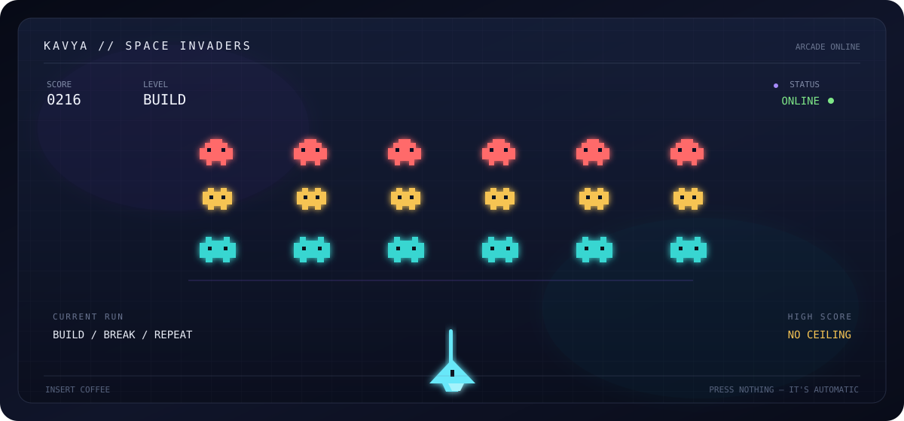

<div align="center">


<br>

## 👾 The invaders are here.

This is a real, playable **Space Invaders-style arcade game** built with plain HTML, CSS, and JavaScript.
No framework. No install. Just open the game and start firing.

<br>

<a href="./game.html">
  
</a>

<br><br>

<a href="./game.html"><strong>▶ PLAY SPACE INVADERS</strong></a>

<br><br>

`MOVE` &nbsp; `FIRE` &nbsp; `CLEAR THE WAVE` &nbsp; `BEAT YOUR HIGH SCORE`

</div>

---

## 🕹️ How to play

| Action | Keyboard | Touch |
|---|---|---|
| Move | `←` `→` or `A` `D` | ◀ / ▶ |
| Fire | `Space` | **FIRE** |
| Start | `Enter` or **START RUN** | **START RUN** |

Destroy every alien before the formation reaches the bottom. Each cleared wave gets faster and more crowded. You have **three lives**, and your best score is saved in the browser.

## ⚡ What is in the cabinet?

- Three rows of neon invaders with different point values
- Increasing waves that get faster as you survive
- Enemy fire, hit flashes, explosions, lives, and a persistent high score
- Responsive canvas that works on desktop and mobile
- Touch controls for playing without a keyboard
- A deliberately tiny dependency footprint: **zero packages**

## 🚀 Run it

There is nothing to install.

1. Open [`game.html`](./game.html).
2. Press **START RUN**.
3. Move, fire, and keep the invasion off the planet.

For local development, any static server works:

```bash
python3 -m http.server
```

Then open `http://localhost:8000/game.html`.

## 🧠 Why this project?

Because a portfolio should be something you can play, not just something you can scroll past.

This little arcade cabinet is an experiment in making a familiar game from first principles: a game loop, canvas rendering, keyboard and pointer input, collision detection, wave progression, and browser persistence. The code is intentionally readable enough to tinker with.

## 🔧 Project map

```text
.
├── game.html       # the complete playable game
├── invaders.svg    # README arcade artwork
└── README.md       # you are here
```

## 🌌 About the pilot

I'm **Kavya**, a Computer Science undergraduate interested in AI/ML, intelligent systems, and software that feels a little less ordinary.

I like learning by building, breaking things on purpose, and turning “what if?” into something people can actually try.

<a href="https://github.com/Kavya-216">
  
</a>

---

<div align="center">

### INSERT COIN. PRESS START. 👾

<sub>Built with curiosity, pixels, and an unreasonable number of laser shots.</sub>

</div>
