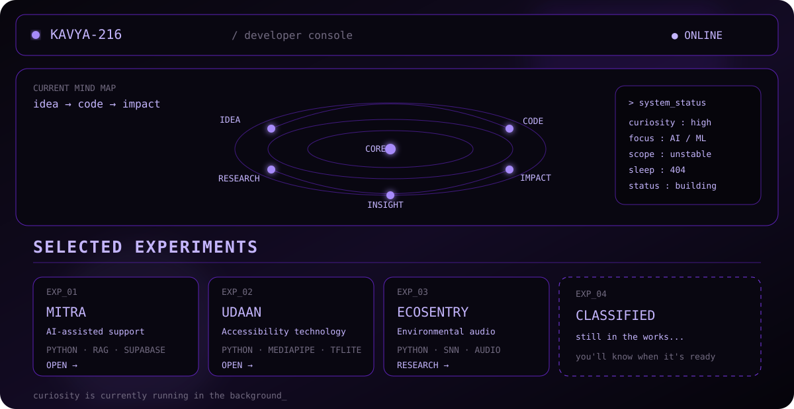

 

AI / ML · PYTHON · EXPERIMENTS · SYSTEMS

  

<a href="#console">[ ENTER CONSOLE ]</a>
  ·  
<a href="https://github.com/Kavya-216?tab=repositories">[ REPOSITORIES ]</a>

the short version

I am a CSE undergraduate who likes taking a "what if?" and seeing how far it can go.

Currently exploring AI/ML, intelligent systems and Python, while building projects that are hopefully more interesting than another tutorial clone.

<b>open / selected experiments</b>

 

EXP_01 — MITRA
AI-assisted legal & support platform · Python RAG Supabase
SheBuilds / Runner-Up

EXP_02 — UDAAN
Accessibility-focused technology · Python MediaPipe TensorFlow Lite
NMIT Vibe-O-Thon / Overall Runner-Up

EXP_03 — ECOSENTRY
Environmental audio intelligence · Python SNN Audio
Research / In Progress

EXP_04 — CLASSIFIED
The repository appears when it survives development.

 

<a href="https://github.com/Kavya-216?tab=repositories">OPEN REPOSITORIES →</a>

QUESTION → BUILD → BREAK → UNDERSTAND → BUILD BETTER

  

<a href="https://github.com/Kavya-216">GITHUB</a>
  ·  
<a href="https://github.com/Kavya-216?tab=repositories">PROJECTS</a>

  

thanks for stalking. curiosity is currently running in the background.

    </td>
    <td width="50%" valign="top">
      <h3><b>02. Multi-Agent Orchestration</b></h3>
      
<i>AI System Architecture</i>

      
Exploratory architecture integrating various open-source AI packages to build seamless, conversational chatbot interfaces powered by collaborating AI agents.

    </td>
  </tr>
</table>

 

---

 

  
<code>&gt; exit_and_connect()</code>

  
  

  
  
  
   
  
  
  
  

 

<!-- GEEK STYLE PROJECT SHOWCASE -->
<h3 align="center"> 🚀 Deployments & Research </h3>

<table align="center" width="100%">
  <tr>
    <td width="50%">
      <code><b>./projects/EcoSentry.sh</b></code> 
      <b>Type:</b> Spiking Neural Networks[cite: 1] 
      <b>Output:</b> Real-time sound classification system with an IoT gateway simulation for environmental alerts[cite: 1].
    </td>
    <td width="50%">
      <code><b>./projects/Pocket_Sonar.exe</b></code> 
      <b>Type:</b> Audio Signal Processing 
      <b>Output:</b> Hackathon app using smartphone mics, spectral analysis, and pretrained classification models.
    </td>
  </tr>
  <tr>
    <td width="50%">
      <code><b>./projects/Mitra.py</b></code> 
      <b>Type:</b> RAG Architecture & Supabase[cite: 1] 
      <b>Output:</b> Legal AI chatbot parsing complex documents, complete with Speech-to-Text mood tracking[cite: 1].
    </td>
    <td width="50%">
      <code><b>./projects/Udaan.sol</b></code> 
      <b>Type:</b> MediaPipe & Smart Contracts[cite: 1] 
      <b>Output:</b> Sign-language recognition pipeline and decentralized disability ID verification[cite: 1].
    </td>
  </tr>
</table>

 

<!-- GITHUB MATRIX STATS -->
<h3 align="center"> 📊 Telemetry </h3>

  <!-- Using the "radical" and dark themes to give it a hacker matrix look -->
  
  

 

  
<code>Connection established:</code>

  
  
    
  <!-- Sleek terminal style view counter -->
  

