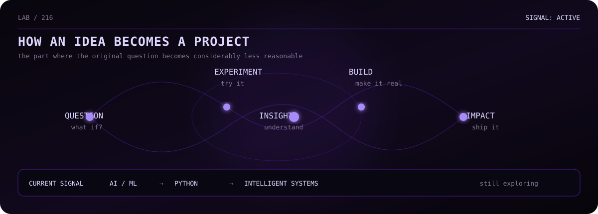

 

AI / ML   PYTHON   INTELLIGENT SYSTEMS   EXPERIMENTS

  

<a href="#selected-work">WORK</a>  ·  <a href="#current">CURRENT</a>  ·  <a href="#repositories">REPOSITORIES</a>

 

<table align="center">
<tr>
<td width="58%" valign="top">

KAVYA-216

CSE undergraduate interested in AI/ML, intelligent systems, and building things that begin with a question rather than a tutorial.

The usual sequence is:

what if? → let's try it → why is the scope this big? → it works

</td>
<td width="42%" valign="top">

NOW

focus  AI / ML
build  projects + experiments
language  Python
status  curious

37 tabs open

</td>
</tr>
</table>

SELECTED WORK

<table align="center">
<tr>
<td width="33%" valign="top">

01

MITRA

AI-assisted legal & support platform.

Python RAG Supabase

SheBuilds · Runner-Up

<a href="https://github.com/Kavya-216?tab=repositories">OPEN →</a>

</td>
<td width="33%" valign="top">

02

UDAAN

Accessibility-focused technology using computer vision and assistive tooling.

Python MediaPipe TFLite

Vibe-O-Thon · Overall Runner-Up

<a href="https://github.com/Kavya-216?tab=repositories">OPEN →</a>

</td>
<td width="33%" valign="top">

03

ECOSENTRY

Environmental audio intelligence with spiking neural networks.

Python SNN Audio

Research · In Progress

<a href="https://github.com/Kavya-216?tab=repositories">OPEN →</a>

</td>
</tr>
</table>

CURRENT

<table align="center">
<tr>
<td align="center" width="33%">

LEARNING

AI / ML
Python
Computer Science

</td>
<td align="center" width="33%">

EXPLORING

Intelligent systems
Efficient AI
Unusual problems

</td>
<td align="center" width="33%">

BUILDING

Projects
Experiments
The next questionable idea

</td>
</tr>
</table>

 

LEARN → BUILD → BREAK → UNDERSTAND → BUILD BETTER

<b>there's probably nothing interesting here</b>

 

kavya@github ~ % sudo reveal_secret

access denied

Nice try.

REPOSITORIES

<a href="https://github.com/Kavya-216?tab=repositories">OPEN THE REPOSITORIES →</a>

  

  

